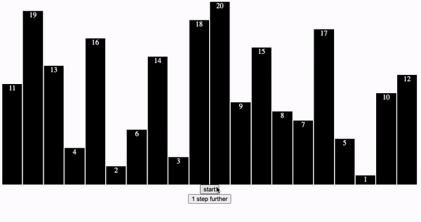

# Bubble Sort Algorithm



- Algorithm is fully typed, written in a functional way without mutating the variables.
- Visualization made in React.js using the iterator pattern.

Iterator Pattern:

- https://developer.mozilla.org/en-US/docs/Web/JavaScript/Guide/Iterators_and_Generators

The goal is to sort an array of numbers. I used hanoi towers to visualize my process of thinking. The first two numbers from the array A are compared. The smaller number is moved to array B, while the bigger number remains in the first array A. This function continues until there is only one element left in the array A - this is the highest number and it can be moved to the result array C.
Since then the middle array is passed to the bubbleSort function as A array the process of sorting continues until all numbers find place in result array C.


| A           | B         | C   |
| ----------- | --------- | --- |
| [3,2,4,5,1] | []        | []  |
| [3,4,5,1]   | [2]       | []  |
| [4,5,1]     | [2,3]     | []  |
| [5,1]       | [2,3,4]   | []  |
| [5]         | [2,3,4,1] | []  |
| []          | [2,3,4,1] | [5] |
| [2,3,4,1]   | []        | [5] |
| [3,4,1]     | [2]       | [5] |

... and so on

### Algorithm:

```typescript
const input = [3, 2, 4, 5, 1];

const bubbleSort = (
  input: number[],
  middleArray: number[],
  result: number[]
): number[] => {
  const [firstElement, ...rest] = input;
  const [secondElement, ...rest2] = rest;

  if (!secondElement) {
    const newResult = [firstElement, ...result];
    if (middleArray.length === 0) {
      return newResult;
    } else {
      return bubbleSort(middleArray, [], newResult);
    }
  } else {
    const smallestNumber =
      firstElement < secondElement ? firstElement : secondElement;
    const biggerNumber =
      firstElement > secondElement ? firstElement : secondElement;

    const newMiddleArray = [smallestNumber, ...middleArray];
    const newInput = [biggerNumber, ...rest2];

    return bubbleSort(newInput, newMiddleArray, result);
  }
};

const result = bubbleSort(input, [], []);

console.log(result);
```
